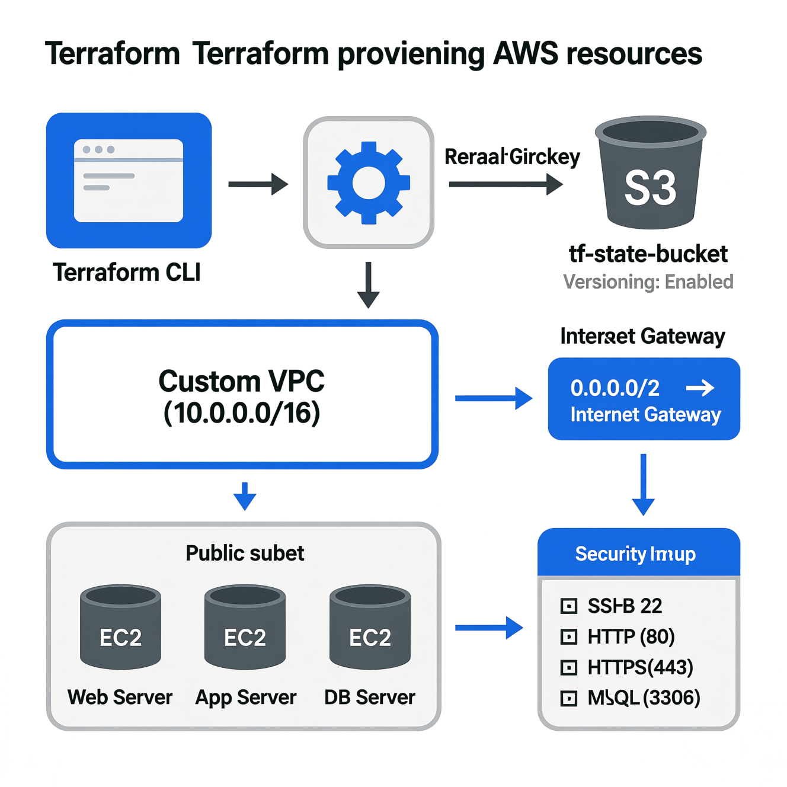
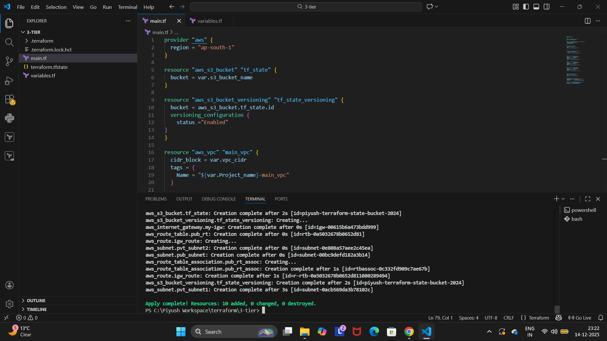
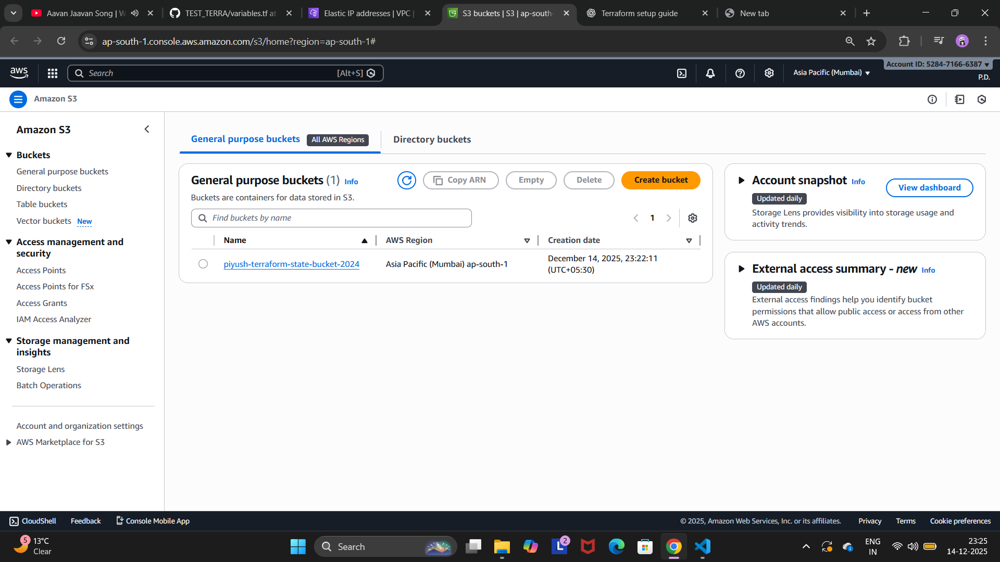
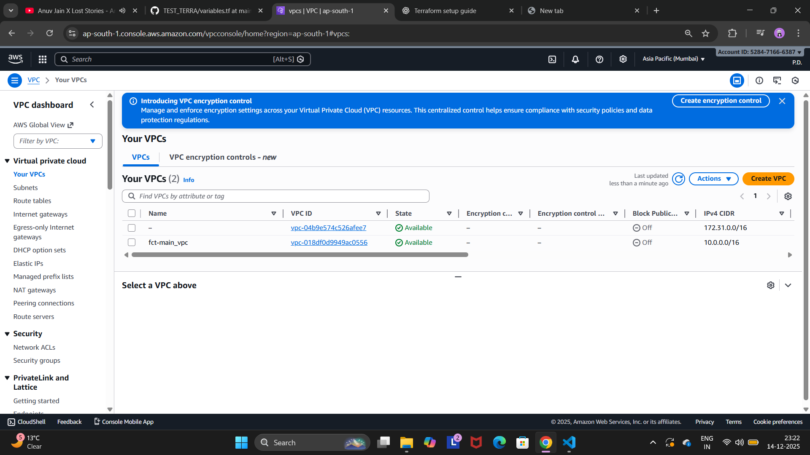
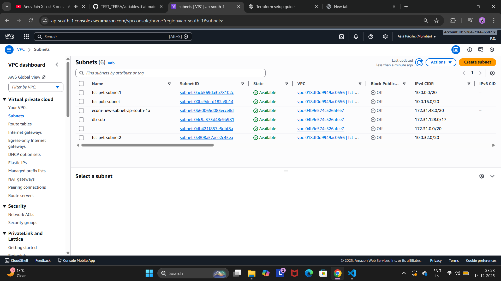
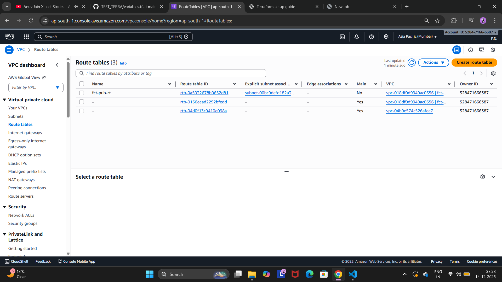
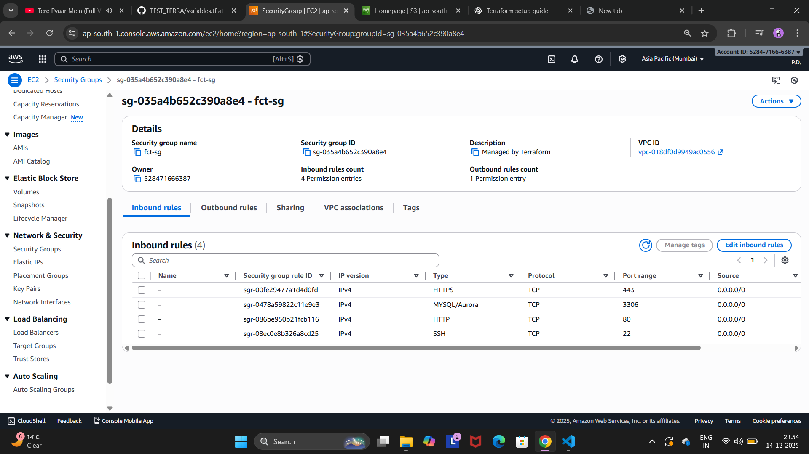
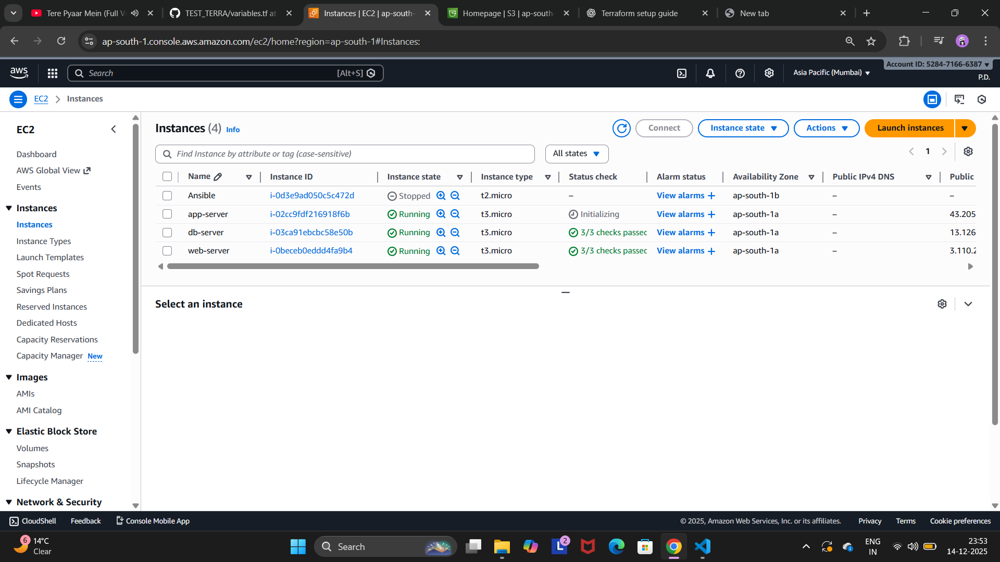

# Terraform AWS 3-Tier Infrastructure Setup

## Overview
This project provisions a basic AWS infrastructure using Terraform.  
It includes a VPC, public and private subnets, internet gateway, route tables, security group, S3 bucket for Terraform state, and EC2 instances (web, app, and database).

The setup is created in the **ap-south-1 (Mumbai)** region and is suitable for learning, demos, and basic DevOps practice.

---


## Prerequisites
- AWS account
- AWS CLI installed and configured (`aws configure`)
- Terraform installed (v1.x recommended)
- An existing EC2 key pair in the target region

---

## Project Structure
```
3-tier/
├── main.tf
├── variables.tf
├── terraform.tfstate
├── .terraform/
└── .terraform.lock.hcl
```

---

## Step 1: Initialize and Apply Terraform

Initialize Terraform and download required providers:

```bash
terraform init
```

Validate configuration files:

```bash
terraform validate
```

Review the execution plan:

```bash
terraform plan
```

Apply the configuration to create resources:

```bash
terraform apply
```

Type `yes` when prompted.

---


## Step 2: S3 Bucket (Terraform State)
After `terraform apply`, an S3 bucket is created:
- Used to store Terraform state
- Versioning enabled for safety
- Region: ap-south-1

Verify in AWS Console:
- Services → S3 → Buckets

---


## Step 3: VPC
Terraform creates a custom VPC with:
- CIDR block: `10.0.0.0/16`
- Dedicated Internet Gateway attached

Verify in AWS Console:
- Services → VPC → Your VPCs

---


## Step 4: Subnets
The following subnets are created:
- Public Subnet (for EC2 instances)
- Private Subnet 1
- Private Subnet 2

Verify in AWS Console:
- Services → VPC → Subnets

---



## Step 5: Route Tables and Internet Gateway
- Public route table created
- Route added to Internet Gateway (`0.0.0.0/0`)
- Public subnet associated with the route table

Verify in AWS Console:
- Services → VPC → Route Tables
- Services → VPC → Internet Gateways

---


## Step 6: Security Group
A security group is created with the following inbound rules:
- SSH (22)
- HTTP (80)
- HTTPS (443)
- MySQL (3306)

Outbound traffic is allowed to all destinations.

Verify in AWS Console:
- Services → EC2 → Security Groups

---


## Step 7: EC2 Instances
Terraform launches three EC2 instances:
- Web Server
- App Server
- Database Server

All instances:
- Use the same AMI
- Use the same instance type
- Are attached to the public subnet
- Use the created security group
- Use the specified EC2 key pair

Verify in AWS Console:
- Services → EC2 → Instances

---


## Key Pair Requirement
Ensure the key pair name defined in `variables.tf` already exists in AWS.

To create a key pair manually:
- Services → EC2 → Key Pairs → Create key pair
- Download and store the `.pem` file securely

---

## Cleanup
To delete all resources created by Terraform:

```bash
terraform destroy
```

---

## Notes
- This setup is for learning and testing purposes.
- Database port (3306) is open to all IPs; restrict it in production.
- For production, consider:
  - Private subnets for database
  - NAT Gateway
  - RDS instead of EC2-based database

---

## Author
Piyush Dalvi
